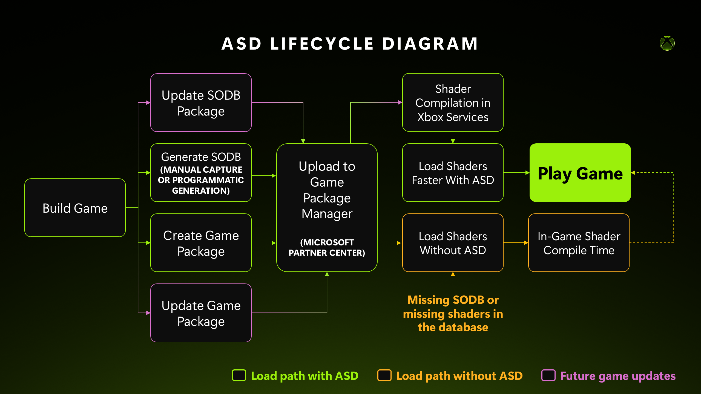

# Prepare your game for Advanced Shader Delivery (ASD)

## Table of contents

- [Prepare your game for Advanced Shader Delivery (ASD)](#prepare-your-game-for-advanced-shader-delivery-asd-1)
- [Prerequisites](#prerequisites)
  - [Confirm ASD support](#confirm-asd-support)
- [Terms and acronyms](#terms-and-acronyms)
- [1. SODB creation](#1-sodb-creation)
  - [1.1 Set the application identity](#11-set-the-application-identity)
  - [1.2 Choose a capture method](#12-choose-a-capture-method)
  - [1.3 Capture method 1: Programmatic SODB generation](#13-capture-method-1-programmatic-sodb-generation)
    - [1.3.1 Build an SODB from a shader list](#131-build-an-sodb-from-a-shader-list)
  - [1.4 Capture method 2: Manual capture](#14-capture-method-2-manual-capture)
    - [1.4.1 Capture via d3dconfig](#141-capture-via-d3dconfig)
    - [1.4.2 Play through the game for full coverage](#142-play-through-the-game-for-full-coverage)
    - [1.4.3 Merge SODBs](#143-merge-sodbs)
- [2. Testing](#2-testing)
  - [2.1 Compile the SODB into a PSDB](#21-compile-the-sodb-into-a-psdb)
  - [2.2 Register the PSDB](#22-register-the-psdb)
  - [2.3 Verify the cache hit rate](#23-verify-the-cache-hit-rate)
  - [2.4 Troubleshoot a low hit rate](#24-troubleshoot-a-low-hit-rate)
- [3. Deployment](#3-deployment)
  - [3.1 Xbox Store](#31-xbox-store)
- [4. Design your next game for pre-compilation](#4-design-your-next-game-for-pre-compilation)
- [References](#references)
- [Appendix A. Command quick reference](#appendix-a-command-quick-reference)

## Prepare your game for Advanced Shader Delivery (ASD)

Advanced Shader Delivery reduces shader compilation times, power consumption, and disruptive stuttering for D3D12 games on PC. Shaders captured from the title are compiled ahead of time and delivered to the player's device alongside it, supplementing the device's shader cache from first launch.

This guide covers three stages of integration:

1. [Create a State Object Database (SODB)](#1-sodb-creation) for your game, by programmatic generation or manual capture.
2. [Test the SODB](#2-testing) by compiling it into a Precompiled Shader Database (PSDB), registering it locally, and confirming its quality.
3. [Deploy the SODB](#3-deployment) to a storefront.

As a developer, you will produce **an SODB** for your title. An SODB is the serialized list of the Pipeline State Objects (PSOs) and State Objects (SOs) your game creates, together with the shader DXIL needed to reconstruct them. After deploying the database to a storefront, it compiles it into a **PSDB** and delivers it to the players. The PSDB is used by the device’s shader cache to load all the shaders during creation.



## Prerequisites

| Requirement | Details |
| --- | --- |
| [**Agility SDK**](https://aka.ms/directx12agility) | 1.619.5 or newer |
| **OS Build** | Windows 11, version 24H2 (build 26100.1000) or newer |
| **GPU / driver** | An ASD-capable GPU and driver. To check, see [Confirm ASD support](#confirm-asd-support) |
| **Tools** | Agility SDK (includes `d3dconfig.exe` and `D3D12StateObjectCompiler.exe`), and [D3D12CacheListener](https://github.com/jenatali/D3D12CacheListener/releases/latest). |

### Confirm ASD support

SODB compilation requires an ASD-supported GPU. Run the following command to check for support:

```console
D3D12StateObjectCompiler.exe list --adapters
```

The adapter supports ASD if `Compiler<Wow>` returns a path to both compilers, and if `Feature Supported` under `ABI Support` returns `<Supported>`:

```console
D3D12 UserMode Driver:
        ...
        Compiler: C:\Windows\System32\DriverStore\FileRepository\...\<IHV_CompilerPlugin>.dll
        CompilerWow: C:\Windows\System32\DriverStore\FileRepository\...\<IHV_CompilerPluginWow>.dll
ABI Support:
        Feature Supported: <Supported>
        ...
```

## Terms and acronyms

| Term | Definition |
| --- | --- |
| ASD | Advanced Shader Delivery |
| SO | State Object. A state object representing raytracing, work graphs, compute programs or graphics program components like the input assembler, rasterizer, pixel shader, and output merger, etc. |
| PSO | Pipeline State Object. A unified state object representing the graphics or compute pipeline. |
| SODB | State object database. The serialized SO/PSO description objects and the shader DXIL needed to reconstruct any create SO/PSO API calls. |
| Shader | A user-defined program that runs on some stage of the graphics processor. Subset of PSO. |
| PSDB | Precompiled Shader Database. The output of compiling an SODB with an IHV compiler plugin. |
| IHV | Independent Hardware Vendor (GPU vendor). |
| ISV | Independent Software Vendor (game/app developer). |

## 1. SODB creation

Creating an SODB has two parts: set up your application identity, then fill the SODB with your pipelines through programmatic generation or manual capture.

### 1.1 Set the application identity

Setting application identity is an essential step of SODB creation. Every SODB must carry a matching **application identity:**

`D3D12_APPLICATION_DESC`: exe filename, name, version, engine name, engine version.

This information will be used to apply the correct application-specific profile, binding the resulting PSDB to your game. For the full field definitions and identity precedence rules, see the [Application Identity spec](https://microsoft.github.io/DirectX-Specs/d3d/D3D12ApplicationIdentity.html).

Set the identity before device creation with `ID3D12ApplicationIdentity::SetApplicationIdentity`. The runtime reads it at device creation, so it must be in place before a capture session or before you build the SODB from code:

```cpp
#include <initguid.h>
#include <d3d12.h>

CComPtr<ID3D12ApplicationIdentity> spAppIdentity;
D3D12GetInterface(CLSID_D3D12ApplicationIdentity, IID_PPV_ARGS(&spAppIdentity));

D3D12_APPLICATION_DESC appDesc = {};
appDesc.pExeFilename   = L"game.exe";
appDesc.pName          = L"Application Name";
appDesc.Version.Version = 0x0001000000000000; // 1.0.0.0
appDesc.pEngineName    = L"Engine Name";
appDesc.EngineVersion.Version = 0x0001000000000000; // 1.0.0.0

// AppId is a stable GUID that keys the PSDB to your title on the device.
// Create GUID from VS: Tools -> Create GUID -> Select the format
static constexpr GUID AppId = { /* ... */ };
spAppIdentity->SetApplicationIdentity(&appDesc, AppId);

// Create the D3D12 device after setting the application identity.
```

Alternatively, if you capture without setting the identity first, you can add it to the finished SODB with `D3D12StateObjectCompiler.exe`:

```console
D3D12StateObjectCompiler.exe set-identity \
    --exe-filename "game.exe" \
    --name "Application Name" \
    --app-version 1.0.0.0 \
    --engine "Engine Name" \
    --engine-version 1.0.0.0 \
    "C:\asd\game.sodb"
```

Verify it with:

```console
D3D12StateObjectCompiler.exe get-identity "C:\asd\game.sodb"
```

With the identity set, fill the SODB with your pipelines through one of two capture methods:

### 1.2 Choose a capture method

|  | Programmatic generation ([section 1.3](#13-capture-method-1-programmatic-sodb-generation)) | Manual capture ([section 1.4](#14-capture-method-2-manual-capture)) |
| --- | --- | --- |
| How the pipelines are gathered | The title enumerates its own pipelines and writes them to the database through an API, or translates them from an existing capture mechanism. | The D3D12 runtime records every PSO and SO created during a play session. |
| Engineering effort | Weeks to a few months for a custom engine. Substantially less on a middleware game engine that already supports SODB generation. | No engine changes. Setup is the d3dconfig steps in [section 1.4](#14-capture-method-2-manual-capture), and most of the cost is play time across configurations and hardware. |
| Coverage | Bounded by the completeness of the title's pipeline list. | Bounded by what the play sessions exercise. |
| Repeatability | Automated. Fits into a build. | Manual. Every capture round is a fresh set of play sessions. |
| Best suited to | Titles early in development, and titles that already enumerate their pipelines for other reasons. | Shipped titles, and titles late in development. |

**Programmatic generation** is the recommended long-term approach. Build the integration now on a new title, or one still early in development, so the engine produces the SODB as part of a build.

**Manual capture** is the recommended short-term approach. It reaches a usable SODB fastest and needs no engine changes, which suits a title that has already shipped or is close to shipping. Set the identity on the captured SODB with set-identity.

**Where a middleware engine**, such as Unreal Engine, its path supersedes both methods below. Consult that engine's documentation for its ASD support.

> [!NOTE]
> **If you’re thinking about even longer-term strategies:** check out [section 4. Design your next game for pre-compilation](#4-design-your-next-game-for-pre-compilation).

### 1.3 Capture method 1: Programmatic SODB generation

Programmatic SODB generation builds the SODB from code.

#### 1.3.1 Build an SODB from a shader list

Build the SODB from a known list of Pipeline State Objects and State Objects with the `ID3D12StateObjectDatabase` API.

Follow these steps:

1. Retrieve the factory with `D3D12GetInterface(CLSID_D3D12StateObjectFactory, ...)`.
2. Create the database with `ID3D12StateObjectDatabaseFactory::CreateStateObjectDatabaseFromFile`.
3. Set the [application identity](#11-set-the-application-identity) with `ID3D12StateObjectDatabase::SetApplicationDesc`.
4. For each pipeline in your list, call `StorePipelineStateDesc` (PSOs) or `StoreStateObjectDesc` (state objects) with the corresponding descriptor and shader DXIL.

    ```cpp
    #include <initguid.h>
    #include <d3d12.h>

    // Retrieve the factory.
    CComPtr<ID3D12StateObjectDatabaseFactory> spFactory;
    D3D12GetInterface(CLSID_D3D12StateObjectFactory, IID_PPV_ARGS(&spFactory));

    // Create the SODB on disk.
    Microsoft::WRL::ComPtr<ID3D12StateObjectDatabase> spSODB;
    spFactory->CreateStateObjectDatabaseFromFile(
        L"C:\\asd\\game.sodb",
        D3D12_STATE_OBJECT_DATABASE_FLAG_NONE,
        IID_PPV_ARGS(&spSODB));

    // Stamp the application identity.
    D3D12_APPLICATION_DESC appDesc = {};
    appDesc.pExeFilename   = L"game.exe";
    appDesc.pName          = L"Application Name";
    appDesc.Version.Version = 0x0001000000000000; // 1.0.0.0
    appDesc.pEngineName    = L"Engine Name";
    appDesc.EngineVersion.Version = 0x0001000000000000; // 1.0.0.0
    spSODB->SetApplicationDesc(&appDesc);

    // For each pipeline, store its descriptor + DXIL:
    //   spSODB->StorePipelineStateDesc(key, keySize, version, &streamDesc);  // PSOs
    //   spSODB->StoreStateObjectDesc(key, keySize, version, &stateObjectDesc); // SOs
    ```

Build a list of every PSO and SO your game uses, iterate over it, and `Store*` each one. Make sure not to gate it through cap checks when enumerating the set of pipelines. The goal is a device-agnostic SODB that covers every pipeline across all supported hardware and settings.

See [StateObjectDatabase](https://microsoft.github.io/DirectX-Specs/d3d/StateObjectDatabase.html) for the complete, runnable API example, and the [D3D12StateObjectDatabase sample](https://github.com/microsoft/DirectX-Graphics-Samples/tree/master/Samples/Desktop/D3D12StateObjectDatabase) for working sample code that generates an SODB programmatically.

### 1.4 Capture method 2: Manual capture

Manual capture serializes every PSO and SO the D3D12 runtime creates during a play session. **Coverage depends directly on how thoroughly you exercise the game** (see [Play through the game for full coverage](#142-play-through-the-game-for-full-coverage)).

#### 1.4.1 Capture via d3dconfig

1. **Add your game’s executable name to the app list.**

    ```console
    d3dconfig.exe apps --add <exefilename>
    ```

2. **Set the SODB output path.**

    ```console
    d3dconfig.exe device pso-db-path=<filepath>.sodb
    ```

3. **Enable SODB collection.**

    ```console
    d3dconfig.exe device enable-pso-db=true
    ```

4. **Play through the game**, then exit. The runtime writes the PSOs and SOs created by the D3D12 API to the SODB path from step 2. See [Play through the game for full coverage](#142-play-through-the-game-for-full-coverage).
5. **Reset d3dconfig settings** when collection is complete.

    ```console
    d3dconfig.exe --reset
    ```

6. **Checkpoint the SODB**

    ```console
    D3D12StateObjectCompiler.exe checkpoint-db <filepath>.sodb
    ```

#### 1.4.2 Play through the game for full coverage

Tips to maximize coverage during manual capture:

- **Play a representative portion of your game under a variety of graphics options.** The pipelines are created as the game runs, so you need to play through content with each configuration. For example: play through a representative section with each graphics preset, both with and without ray tracing enabled.
- **Restart the game between configuration changes, if needed.** Depending on your game's architecture, a restart may be necessary to ensure all content is captured under the new settings. For example, if your game compiles shaders once at startup rather than reacting to setting changes mid-session. If you're unsure whether a setting fully takes effect at runtime, restart to be safe.
- **If the game does not have a dedicated shader loading screen**, play through major sections of the game.
- **Capture on a variety of hardware to exercise device-specific code paths.** Depending on your engine architecture, you may have device-specific branches. Code that selects different pipelines based on the GPU, driver, or feature support. A single machine only exercises the branches that apply to it, so all the other paths won't appear in an SODB captured there. To get thorough coverage across all devices, capture at least one SODB per IHV so every branch runs, then merge the results into one master SODB.

#### 1.4.3 Merge SODBs

Merge multiple capture runs into one SODB with `D3D12StateObjectCompiler.exe`:

```console
D3D12StateObjectCompiler.exe merge-sodb \
    C:\asd\run1.sodb \
    C:\asd\run2.sodb \
    ...              \
    C:\asd\runX.sodb
```

This method merges multiple SODBs into an already existing one, preserving the original [application identity](#11-set-the-application-identity).

Verify the [application identity](#11-set-the-application-identity) data with the following command:

```console
D3D12StateObjectCompiler.exe get-identity "C:\asd\runX.sodb"
```

## 2. Testing

Before deploying, validate locally that your SODB produces a PSDB with a good cache hit rate on your target hardware.

### 2.1 Compile the SODB into a PSDB

Compile your SODB into a PSDB with `D3D12StateObjectCompiler.exe`. The compiler uses the IHV plugin registered with the currently installed GPU driver, or an explicit `--plugin` path:

```console
D3D12StateObjectCompiler.exe compile \
    --adapter 0 \
    --name "Application Name" \
    --exe-filename "game.exe" \
    C:\asd\game.sodb \
    C:\asd\game.psdb
```

> [!NOTE]
> Use `--adapter <index>` to compile with a locally installed adapter’s plugin, or `--plugin <path>` with an explicit `--adapter-family` / `--abi` to target a specific plugin. Run `D3D12StateObjectCompiler.exe list --adapters` to enumerate adapters and adapter families.

### 2.2 Register the PSDB

Register the PSDB with d3dconfig:

1. Add your game's executable to the d3dconfig app list.

    ```console
    d3dconfig.exe apps --add <exefilename>
    ```

2. Select the PSDB.

    ```console
    d3dconfig.exe device precompiled-db-path=<filepath>.psdb
    ```

3. Confirm the registration override is enabled. It defaults to true, so this step is only needed if it was turned off previously:

    ```console
    d3dconfig.exe device precompiled-db-registration-override=true
    ```

4. Restart the game. These settings are read once before device creation, the game must start after they're set. And clear the GPU's shader cache.
5. Reset d3dconfig settings when you finish testing:

    ```console
    d3dconfig.exe --reset
    ```

> [!NOTE]
> To fall back to the older path-only behavior (path override with compatibility checks disabled), set precompiled-db-registration-override=false or precompiled-db-path=””.

### 2.3 Verify the cache hit rate

1. Download the latest [D3D12CacheListener](https://github.com/jenatali/D3D12CacheListener/releases/latest).
2. Run `D3D12CacheListener.exe` **as Administrator**. It listens to Event Tracing for Windows (ETW) events and requires elevation.
3. Launch your game and play for a few minutes while CacheListener observes.
4. Read the reported cache hit rate. In principle, replaying any area of the game you captured should give a 100% cache hit rate, since every pipeline that runs was already recorded into the SODB. In practice, a few factors keep real-world numbers below that ceiling:
    - **Differences between capture and playback configuration**. A different GPU, driver, or settings combination can create pipelines your capture never saw.
    - **Test and capture playthroughs rarely match exactly**. A different route or set of actions can trigger pipelines you didn't exercise during capture.
    - **IHVs may not yet support 100% of all PSOs and SOs.**
- We generally consider ≥ 90% a good result, meaning that ASD is working and the driver is serving most pipelines from the precompiled PSDB. **A low or 0% hit rate points to a problem**, see [Troubleshoot a low hit rate](#24-troubleshoot-a-low-hit-rate).

### 2.4 Troubleshoot a low hit rate

| Symptom | Likely cause | What to check |
| --- | --- | --- |
| 0% hit rate | Identity mismatch | The SODB and PSDB application identity must match the running game (see [Set the application identity](#11-set-the-application-identity)). |
| 0% hit rate, plus HasDefaultPSDB == False | Registration mismatch | Registration is keyed by the exe path. Confirm the --exe-path you passed to register exactly matches the path of the running game executable. |
| Low hit rate | Incomplete capture coverage | Cycle through presets and play more scenarios; [merge](#143-merge-sodbs) additional captures. |
| Low hit rate | Missing IHV specific shaders | Capture an additional SODB on hardware where the hit rate is low and [merge SODBs](#143-merge-sodbs) |

## 3. Deployment

After your SODB produces a PSDB with a healthy hit rate, it’s time to hand the SODB off to a storefront that supports ASD. Regardless of store, the deployment flow is the same:

1. You submit your SODB alongside your game package.
2. The store runs a server-side compile of your SODB against each IHV's compiler plugin, producing a per-driver PSDB.
3. The store delivers the matching PSDB to each player's device according to the driver.

### 3.1 Xbox Store

Refer to Xbox’s official documentation for the current submission steps:

- [Advanced Shader Delivery: what's new at GDC 2026](https://devblogs.microsoft.com/directx/advanced-shader-delivery-whats-new-at-gdc-2026/) — overview and Partner Center SODB upload.
- [Package Uploader](https://github.com/microsoft/PackageUploader#example-uploadxvcpackage-operation) — automate SODB and package submission.

## 4. Design your next game for pre-compilation

This section is aimed at strategizing your next game project (or early in-development).

- **Tradeoffs between IHV-specific code paths:**
    - Device-specific branches can multiply the pipelines that must be precompiled. Minimizing this divergence has real benefits: a smaller SODB, less to compile and deliver per device. For example, sharing a single root signature across hardware vendors instead of per-vendor variants keeps a pipeline uniform everywhere. That said, convergence isn't free. Some vendor-specific paths exist because they perform better on that hardware, and collapsing them can cost performance. The right balance depends on your title's performance targets and how much per-device tuning matters to you.
- **Partial programs**
    - For titles with very large numbers of pipeline state objects, partial graphics programs split pipeline creation into reusable pieces. This reduces duplication in what needs to be precompiled, and how much the store must compile per device.
- **The long-term goal**
    - The direction for ASD is for SODB collection to become a built-in part of the development process. With that, it’s good to think about how to optimize it for future workflows.

## References

- [State Object Database specification](https://microsoft.github.io/DirectX-Specs/d3d/StateObjectDatabase.html) — read the complete `ID3D12StateObjectDatabase` API reference and a runnable capture example.
- [D3D12StateObjectDatabase sample](https://github.com/microsoft/DirectX-Graphics-Samples/tree/master/Samples/Desktop/D3D12StateObjectDatabase) — sample code that generates an SODB programmatically.
- [D3D12CacheListener](https://github.com/jenatali/D3D12CacheListener/releases/latest) — download the tool you use in [Testing](#2-testing) to verify your cache hit rate.
- [PackageUploader](https://github.com/microsoft/PackageUploader#example-uploadxvcpackage-operation) — automate SODB and package submission to the Xbox Partner Center.
- [Advanced Shader Delivery: what’s new at GDC 2026](https://devblogs.microsoft.com/directx/advanced-shader-delivery-whats-new-at-gdc-2026/) — Xbox Partner Center SODB upload and the latest ASD updates.

## Appendix A. Command quick reference

| Task | Command |
| --- | --- |
| Enumerate locally installed adapters and their plugins | `D3D12StateObjectCompiler.exe list --adapters` |
| Add a title to the d3dconfig app list | `d3dconfig.exe apps --add <exe-filename>` |
| Set the capture output path | `d3dconfig.exe device pso-db-path=<absolute-path>.sodb` |
| Start capture | `d3dconfig.exe device enable-pso-db=true` |
| Stop capture | `d3dconfig.exe device enable-pso-db=false` |
| Fold a write-ahead log back into an SODB | `D3D12StateObjectCompiler.exe checkpoint-db <file.sodb>` |
| Restore the previous journaling behavior | `d3dconfig.exe device pso-db-journal-mode=default` |
| Clear all d3dconfig settings without prompting | `d3dconfig.exe --reset --confirm` |
| Merge captures (output first) | `D3D12StateObjectCompiler.exe merge-sodb <in1.sodb> <in2.sodb> … <out.sodb>` |
| Set identity on an SODB | `D3D12StateObjectCompiler.exe set-identity --exe-filename <game.exe> --name <app name> --app-version <a.b.c.d> --engine <engine_name > --engine-version <a.b.c.d> <file.sodb>` |
| Read identity from an SODB | `D3D12StateObjectCompiler.exe get-identity <file.sodb>` |
| Re-create an SODB's contents on a device | `D3D12StateObjectCompiler.exe replay --adapter <n> <file.sodb>` |
| Compile against a local adapter | `D3D12StateObjectCompiler.exe compile --adapter <n> <in.sodb> <out.psdb>` |
| Compile against a specific plugin | `D3D12StateObjectCompiler.exe compile --plugin <plugin.dll> --adapter-family <family> --abi <n> <in.sodb> <out.psdb>` |
| Limit compiler resource use | Add --single-threaded, or --max-threads `<n>` / --priority |
| Point the runtime at a local PSDB | `d3dconfig.exe device precompiled-db-path=<path_to_file>.psdb` |
| Remove a title's settings, including that override | `d3dconfig.exe apps --remove <exe-filename>` |
